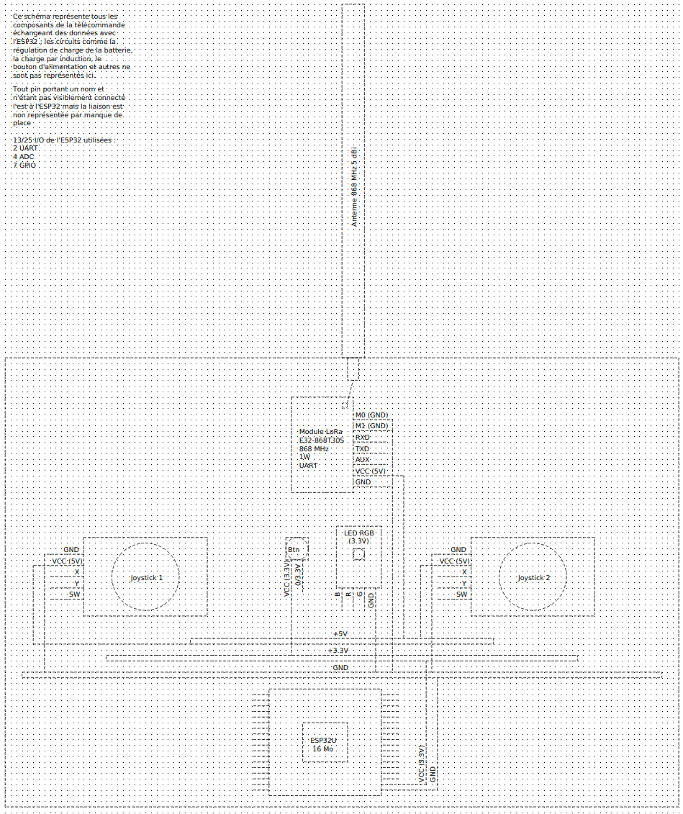
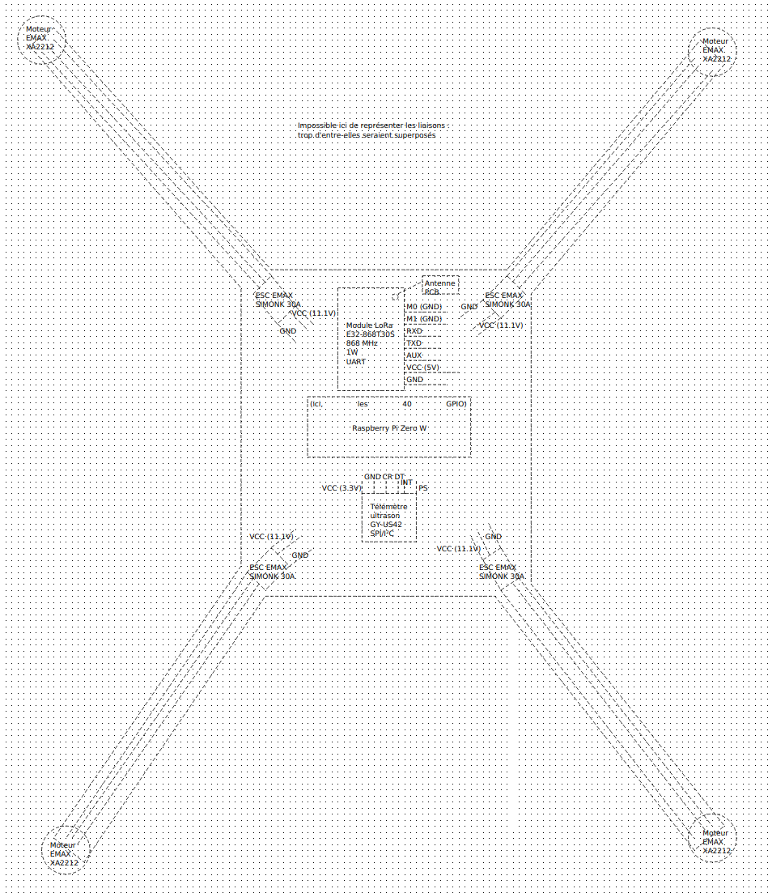
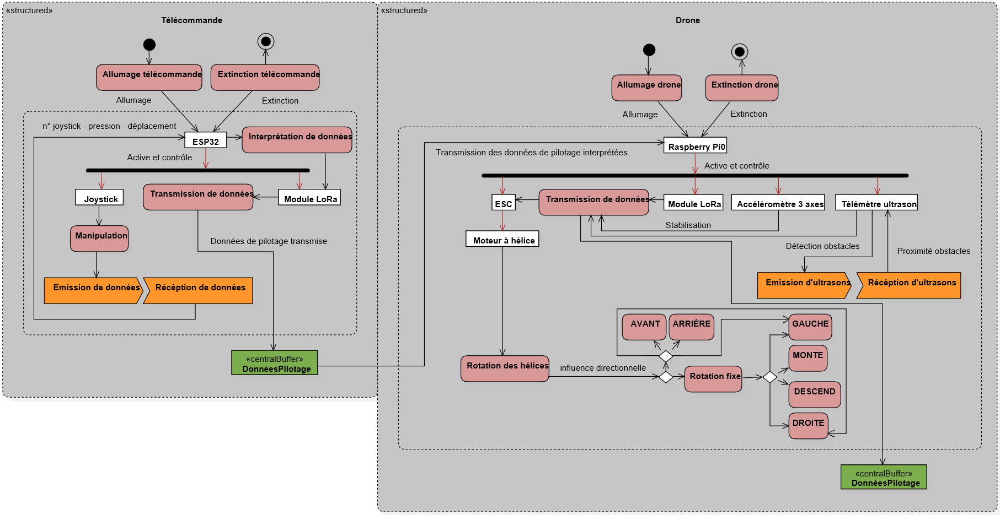
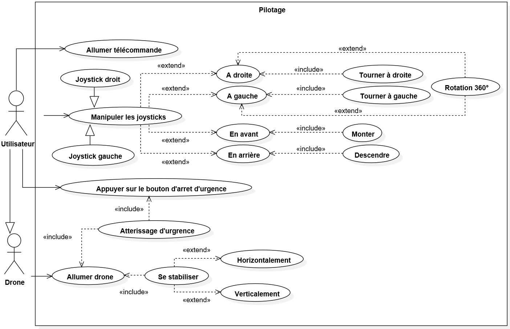
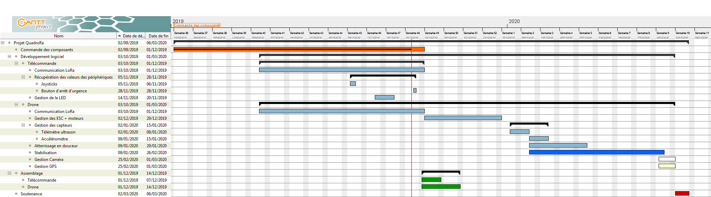

<h1>Cahier des charges</h1>
<h2>Julien CARCAU, Alicia FALCON, Arthur CHENU et Thomas GUILLEMOT</h2>
<h2>Tuteur : Denis MONNERAT</h2>

Le but de ce projet est de réaliser un drone et une télécommande qui lui sera associée. Nous réaliserons les parties logicielle et matérielle.
La télécommande communiquera avec le drone par ondes radio en utilisant le protocole LoRa sur une fréquence de 868 MHz, celle qui est utilisée en Europe (https://fr.wikipedia.org/wiki/LoRaWAN#Modulation_LoRa).
La portée sera théoriquement de 8 km maximum.

<h2>Fonctionnalités :</h2>
Nous allons ici utiliser la méthode MoSCoW (https://fr.wikipedia.org/wiki/M%C3%A9thode_MoSCoW) pour prioriser les taches à effectuer :
Must :
<ul>
<li></li>
<li></li>
<li></li>
<li></li>
<li></li>
<li></li>
<li></li>
</ul>

<h2>Liste des composants :</h2>
Télécommande :
<ul>
<li>PCB (Printed Circuit Board), circuit imprimé pour disposer les composants,</li>
<li>batterie Li-Po 4000 mAh,</li>
<li>module de charge de batterie au lithium,</li>
<li>module de charge sans fil (à induction),</li>
<li>joysticks (x2) KY-023,</li>
<li>LED RGB KY-009,</li>
<li>bouton ON/OFF momentané,</li>
<li>bouton d’arrêt d’urgence momentané,</li>
<li>ESP32-WROOM-32U 16MB (microcontrôleur),</li>
<li>E32-868T30S (communication LoRa),</li>
<li>PCB pour convertir les connecteurs de l’ESP32 vers 36 GPIO,</li>
<li>antenne 868 MHz 17 cm SMA gain 5 dBi,</li>
<li>connecteur SMA-KWE femelle coudé à 90°,</li>
<li>antenne 2.4 GHz (présente ou non en fonction de ce qui sera implémenté),</li>
<li>connecteur SMA-KWE mâle coudé à 90° (présent ou non en fonction de ce qui sera implémenté).</li>
</ul>

Drone :
<ul>
<li>PCB,</li>
<li>Armature F450,</li>
<li>Batterie lithium 3 cellules (11.1 V) (capacité et nombre de "C" à déterminer),</li>
<li>ESC SimonK 30A x4,</li>
<li>Moteurs EMAX XA2212 1400KV x4,</li>
<li>Hélice 8x6 x4,</li>
<li>Antenne PCB,</li>
<li>Raspberry Pi Zero W + micro SD,</li>
<li>Télémètre ultrason GY-US42,</li>
<li>E32-868T30S (communication LoRa),</li>
<li>GPS NEO-6M (présent ou non en fonction de ce qui sera implémenté),</li>
<li>Caméra (présente ou non en fonction de ce qui sera implémenté).</li>
</ul>

<h2>Schémas des composants communicants du drone et de la télécommande :</h2>

<h2>Protocoles de communication utilisés :</h2>
<ul>
<li>Entre le drone et la télécommande, communication bidirectionnelle : LoRa (entre 0,3 et 19,2 kbits/s, à déterminer en fonction des performances : vitesse, distance et consommation électrique) (https://fr.wikipedia.org/wiki/LoRaWAN),
<li>Entre les modules LoRa et les microcontrôleurs, communication bidirectionnelle : UART (avec 8 bits de données, pas de parité, 1 bit de fin et à une vitesse de 9600 bauds) (https://www.youtube.com/watch?v=kVd8Zj413l8),
<li>Entre les joysticks/le bouton d’arrêt d’urgence/la LED RGB et l’ESP32, communication unidirectionnelle, réception uniquement : communication analogique : variation de la tension entre 0 et +3.3V,
<li>Entre le télémètre ultrason et le Raspberry, communication bidirectionnelle : le protocole SPI ou I²C, le module supporte ces 2 protocoles) (SPI : https://www.youtube.com/watch?v=XJLVSVXcSic et I²C : https://www.youtube.com/watch?v=N0YtIzGIW4k)
<li>Entre le Raspberry et les ESC, communication unidirectionnelle, émission uniquement : PWM (Pulse Width Modulation, Modulation par Largeur d’Impulsion) (https://www.aeromodelisme-vemars.com/2016/04/26/pwm-ppm-s-bus-sumd-k%C3%A9sako/)
</ul>
Plus, en fonction de ce qui sera implémenté dans le drone :
<ul>
<li>Entre le drone et la télécommande et entre un smartphone/une tablette/un ordinateur et la télécommande, communication bidirectionnelle : Wi-Fi, sur 2.4 GHz (nécessite une caméra)
<li>Entre le module GPS (un NEO-6M) et le drone, communication unidirectionnelle, réception uniquement : UART.
</ul>

<h2>Explication de l’utilité des composants :</h2>

Le Raspberry Pi (https://fr.wikipedia.org/wiki/Raspberry_Pi) servira à contrôler tous les autres composants du drone :
il sera directement relié aux ESC (Electronic Speed Control), les éléments contrôlant la vitesse des moteurs.
L’accéléromètre permettra d’obtenir l’inclinaison actuelle du drone afin de pouvoir le stabiliser ; les 3 axes de ce dernier seront utilisés pour modéliser son inclinaison dans l’espace sur un plan cartésien tridimensionnel.
Le télémètre ultrason servira à mesurer la distance au sol, ce qui, associé à un autre élément de la télécommande, permettra de déterminer si oui ou non le drone peut se poser.
Le module LoRa permettra de communiquer avec son homologue dans la télécommande.
(De plus, le drone pourrait contenir une caméra qui, via Wi-Fi, transmettr me un smartphone, une tablette ou un ordinateur pourrait s’y connecter afin de récupérer le flux vidéo sur un navigateur.
Il pourrait également contenir un GPS qui lui servirait à retourner à son point de départ ainsi qu’à déterminer son altitude (à + ou – 3 mètres) pour pouvoir toujours en avoir une, même approximative, même quand le télémètre ne peut plus la déterminer du fait d’une distance au sol trop élevée).

Du côté de la télécommande, c’est l’ESP32 qui contrôlera les autres composants.
Le module LoRa permettra de communiquer avec le drone.
Le joystick de gauche contrôlera l’altitude du drone : l’incliner vers le haut fera monter le drone et inversement. Celui de droite, sur l’axe horizontal permettra de déplacer latéralement le drone et sur l’axe vertical, d’avant en arrière.
Un bouton d’arrêt d’urgence sera présent et servira à arrêter les moteurs du drone en cas de nécessité. La LED RGB servira à notifier l’utilisateur de certains évènements notables.

<h2>Diagramme d’activité :</h2>

<h2>Diagramme de cas d’utilisation :</h2>

<h2>Synopsis :</h2>
<ul>
1. 
Bertrand allume la télécommande et le drone en appuyant sur les boutons prévus à cet effet.
La LED présente sur la télécommande s’allume en orange, la connexion entre les deux appareils n’est pas encore établie.
Au bout de quelques secondes, la LED clignote 5 fois rapidement en vert puis de cette même couleur à intervalles réguliers, plus longs.
Bertrand tente alors de faire bouger les joysticks mais rien ne se produit.
Il enfonce alors les deux joysticks en même temps jusqu’à entendre un "clic".
La LED passe au vert en continu.
Bertrand pousse le joystick de gauche vers le haut et le drone, cette fois-ci, décolle.
Après l’avoir utilisé plusieurs minutes, alors que le drone est à quelques mètres du sol, notre ami enfonce par inadvertance les joysticks, mais, heureusement pour lui, rien ne se produit.
En effet, il se rend compte au moment où il souhaite faire atterrir son drone qu’appuyer à une distance faible du sol sur ces joysticks provoque l’arrêt des moteurs afin que le drone puisse se poser, mais seulement en étant suffisamment proche du sol .
De même, la LED passe à nouveau au vert clignotant, signe que la télécommande et le drone sont bien connectés entre eux et que ce dernier est immobilisé.

2. 
Stéphane allume le drone puis, 2 minutes plus tard, la télécommande.
La LED passe presque instantanément au vert clignotant.
Il fait décoller son drone, le LED devient vert fixe et décide de le faire partir le plus loin possible. Au bout d’un moment, la télécommande ne reçoit plus de signal du drone et la LED clignote (plutôt lentement) en orange. Il court pour se rapprocher et reprendre le contrôle de son magnifique drone.
La LED de la télécommande passe directement au vert fixe.
Il décide de l’envoyer à nouveau loin mais cette fois-ci, une fois qu’il en a perdu le contrôle, Stéphane décide d’éteindre sa télécommande et de simplement observer le drone sans tenter d’interagir avec.
[Au bout de quelques secondes, ce dernier descend progressivement, se rapprochant irrémédiablement de l’étang au dessus duquel il était. Juste avant qu’un gros "plouf !" retentisse, les moteurs du drone se coupent à quelques centimètres de la surface.]
OU, suivant l’implémentation de certaines fonctionnalités :
[Au bout de quelques secondes, ce dernier se met à nouveau en mouvement et se dirige vers Stéphane, plus exactement l’endroit d’où il a décollé. Arrivé là, il descend progressivement et se pose sur le sol, au sec et à l’abri.]

</ul>

<h2>Diagramme de Gantt :</h2>
À venir ...

